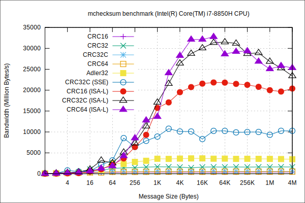

!!! note

    Mercury users should generally not have to directly use the MChecksum library as
    checksumming may be done within Mercury for small messages. For large
    payloads, however, if checksums are desired, users should then be responsible
    for calling MChecksum routines on the buffers.

Mchecksum is a library created in the context of Mercury for checksumming RPC
headers as well as RPC function arguments. In Mercury, checksums are not computed for
bulk data transfers and it is left upon the user to decide whether to verify
transfers or not. Because mchecksum is a separate library, it can be
independently used by applications to verify data integrity. Mchecksum provides
a simple interface and uses a system of plugins to abstract and provide various
hash methods.

## Interface

A checksum object is created using the `mchecksum_init()` function with a
valid hash method (see the [available plugins](#available-plugins) section for
a list of plugins and the `hash_method` format).

```C
int mchecksum_init(const char *hash_method, mchecksum_object_t *checksum);
```

The checksum object is destroyed with a call to `mchecksum_destroy()`.

```C
int mchecksum_destroy(mchecksum_object_t checksum);
```

The checksum can be reset with `mchecksum_reset()`, which prevents an extra
allocation when the checksum needs to be re-used.

```C
int mchecksum_reset(mchecksum_object_t checksum);
```

The size of the checksum can be queried using the `mchecksum_get_size()` call.

```C
size_t mchecksum_get_size(mchecksum_object_t checksum);
```

The computed checksum hash can be retrieved with a call to `mchecksum_get()`.
If `MCHECKSUM_FINALIZE` is passed, the checksum is finalized and no more data
can be added to that checksum, the only valid calls to follow are either
`mchecksum_reset()` or `mchecksum_destroy()`. If `MCHECKSUM_NOFINALIZE` is passed,
more data can be later added to this checksum.

```C
int mchecksum_get(mchecksum_object_t checksum, void *buf, size_t size, int finalize);
```

The checksum is computed on a given piece of data by using the
`mchecksum_update()` call.
Note again that incremental update is allowed unless `mchecksum_get()` has been
called with the `MCHECKSUM_FINALIZE` parameter.

```C
int mchecksum_update(mchecksum_object_t checksum, const void *data, size_t size);
```

## Available Plugins

Below is a list of the currently available plugins as well as corresponding
initialization strings that must be passed to the `mchecksum_init()` call.
Note that
CRC32 and ADLER32 are available through the [ZLIB](http://www.zlib.net/) library and CRC32C is available
with and without SSE4.2 optimization.
When using the [ISA-L](https://github.com/01org/isa-l) library, improved
performance can be achieved for CRC16, CRC32C and CRC64 by using the `PCLMULQDQ`
CPU instruction (when supported).

Plugin | Initialization Format
------ | ---------------------
CRC16  | `crc16`
CRC32  | `crc32`
CRC32C | `crc32c`
CRC64  | `crc64`
ADLER32| `adler32`

## Performance Comparison

Below is a performance comparison of the hash methods defined through mchecksum,
using non-SSE/SSE/ISA-L (v2.24.0) versions. 

<figure>
  
</figure>

## Example

The example below is given for illustration.

```C
#include <mchecksum.h>
#include <stdlib.h>

#define BUF_SIZE 256

int
main(int argc, char *argv[])
{
    unsigned char buf[BUF_SIZE];
    unsigned int i;
    mchecksum_object_t checksum;
    void *hash = NULL;
    size_t hash_size;
    int ret = EXIT_SUCCESS;

    /* Initialize buf */
    for (i = 0; i < BUF_SIZE; i++)
        buf[i] = i;

    /* Initialize checksum */
    mchecksum_init("crc32c", &checksum);

    /* Update checksum */
    mchecksum_update(checksum, buf, BUF_SIZE);

    /* Get size of checksum and allocate buffer to store checksum */
    hash_size = mchecksum_get_size(checksum);
    hash = malloc(hash_size);

    /* Get checksum and finalize it */
    mchecksum_get(checksum, hash, hash_size, MCHECKSUM_FINALIZE);

    /* Use checksum */
    ...

    /* Destroy checksums and free hash buffers */
    mchecksum_destroy(checksum);
    free(hash);

    return ret;
}
```
