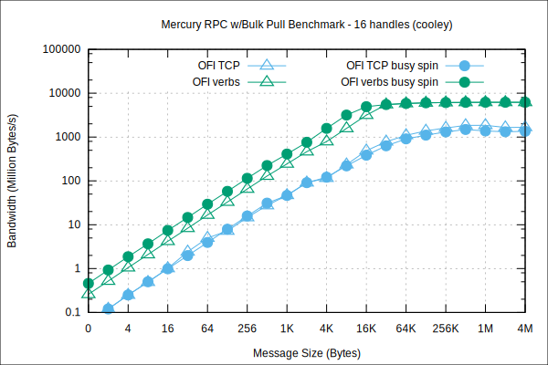

!!! note

    The implementation notes in this page are provided for reference and
    may be slightly out of date. If you are only looking for user documentation,
    please refer to the NA plugin documentation on this [page](na.md#ofi).

## OFI Capabilities

The OFI plugin makes use of the following libfabric capabilities:

* `FI_EP_RDM`
* `FI_DIRECTED_RECV`
* `FI_READ`
* `FI_RECV`
* `FI_REMOTE_READ`
* `FI_REMOVE_WRITE`
* `FI_RMA`
* `FI_SEND`
* `FI_TAGGED`
* `FI_WRITE`
* `FI_SOURCE`
* `FI_SOURCE_ERR`
* `FI_ASYNC_IOV`
* `FI_CONTEXT`
* `FI_MR_BASIC`
* Scalable endpoints

## Feature Matrix

 * Supported :heavy_check_mark:
 * Limited support or emulated :exclamation: (see footnote)
 * Not supported :x:

Feature | tcp | verbs | psm2 | gni
--------|-----|-------|------|-------------
Source Addressing | :exclamation:[1](#addressing_emul) | :exclamation:[1](#addressing_emul) | :heavy_check_mark: | :heavy_check_mark:
Manual Progress | :exclamation:[2](#progress_emul) | :heavy_check_mark: | :exclamation:[2](#progress_emul) | :exclamation:[2](#progress_emul)
`FI_WAIT_FD` | :heavy_check_mark: | :heavy_check_mark: | :heavy_check_mark: | :x:
Scalable Endpoints | :exclamation:[3](#scal_emul) | :x: | :heavy_check_mark: | :heavy_check_mark:

<a name="addressing_emul">1</a> *Emulated:* source address is encoded
in the message header.

<a name="progress_emul">2</a> *Emulated:* the provider is using a thread to drive background progress.

<a name="scal_emul">3</a> *Emulated:* provider resources are shared.

## Performance

Below is a performance comparison of the libfabric plugin  with available libfabric providers when using both
wait and busy spin mechanisms, mercury v1.0.0 and libfabric v1.7.0a1.

### InfiniBand `verbs;rxm`

Performance is measured between two nodes on ALCF's [cooley](https://www.alcf.anl.gov/user-guides/cooley) cluster using the FDR InfiniBand interface `mlx5_0`.
The following plot shows the RPC average time
compared to `ofi+tcp` when using one single RPC in-flight:

<figure>
  
</figure>

Same plot but with 16 RPCs in-flight:

<figure>
  
</figure>

The following plot shows the RPC with *pull* bulk transfer performance
compared to `ofi+tcp` with various transfer sizes:

<figure>
  
</figure>

Same plot but with 16 RPCs in-flight:

<figure>
  
</figure>

The following plot shows the RPC with *push* bulk transfer performance
compared to `ofi+tcp` with various transfer sizes:

<figure>
  
</figure>

Same plot but with 16 RPCs in-flight:

<figure>
  
</figure>

### Omni-Path `psm2`

Performance is measured between two nodes on LCRC's [bebop](https://www.lcrc.anl.gov/systems/resources/bebop/) cluster using the Omni-Path interface with PSM2 v11.2.23.
The following plot shows the RPC average time
compared to `ofi+tcp` when using one single RPC in-flight:

<figure>
  
</figure>

Same plot but with 16 RPCs in-flight:

<figure>
  
</figure>

The following plot shows the RPC with *pull* bulk transfer performance
compared to `ofi+tcp` with various transfer sizes:

<figure>
  
</figure>

Same plot but with 16 RPCs in-flight:

<figure>
  
</figure>

The following plot shows the RPC with *push* bulk transfer performance
compared to `ofi+tcp` with various transfer sizes:

<figure>
  
</figure>

Same plot but with 16 RPCs in-flight:

<figure>
  
</figure>

### Aries `gni`

Performance is measured between two Haswell nodes (debug queue in exclusive mode) on Nersc's [cori](http://www.nersc.gov/users/computational-systems/cori/) system using the interface `ipogif0` with uGNI v6.0.14.0.
The following plot shows the RPC average time
compared to `ofi+tcp` when using one single RPC in-flight:

<figure>
  
</figure>

Same plot but with 16 RPCs in-flight:

<figure>
  
</figure>

The following plot shows the RPC with *pull* bulk transfer performance
compared to `ofi+tcp` with various transfer sizes:

<figure>
  
</figure>

Same plot but with 16 RPCs in-flight:

<figure>
  
</figure>

The following plot shows the RPC with *push* bulk transfer performance
compared to `ofi+tcp` with various transfer sizes:

<figure>
  
</figure>

Same plot but with 16 RPCs in-flight:

<figure>
  
</figure>
