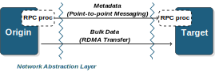

Mercury is composed of three main layers:

1. the [network abstraction layer](na.md), which provides
  a high-performance communication interface on top of lower level network
  fabrics.
2. the [RPC layer](hg.md), which provides users with the necessary
  components for sending and receiving RPC metadata (small messages). This includes
  serialization and deserialization of function arguments;
3. the [bulk layer](hg_bulk.md), which provides the necessary components for
  handling large arguments---this implies large data transfers through RMA;
4. the (*optional*) [high-level RPC layer](hg_macros.md), which aims at
  providing a convenience API, builds on top of the lower layers and provides
  macros for generating RPC stubs as well as serialization and deserialization
  functions.

These three main layers can be summarized in the following diagram:

<figure markdown>
  { width="500px" }
  <!--- <figcaption>Image caption</figcaption> --->
</figure>

By definition, an RPC call is initiated by one process, referred to as
_origin_, and forwarded to another process, which will execute the call,
and referred to as _target_. Each side, origin and target, uses an RPC
_processor_ to serialize and deserialize parameters sent through the interface.
Calling functions with relatively small arguments results in using a short
messaging mechanism exposed by the network abstraction layer, whereas functions
containing large data arguments additionally use a remote memory access (RMA)
mechanism. Note that when the bulk data is small enough, Mercury will
automatically embed it along with the metadata if it can fit.